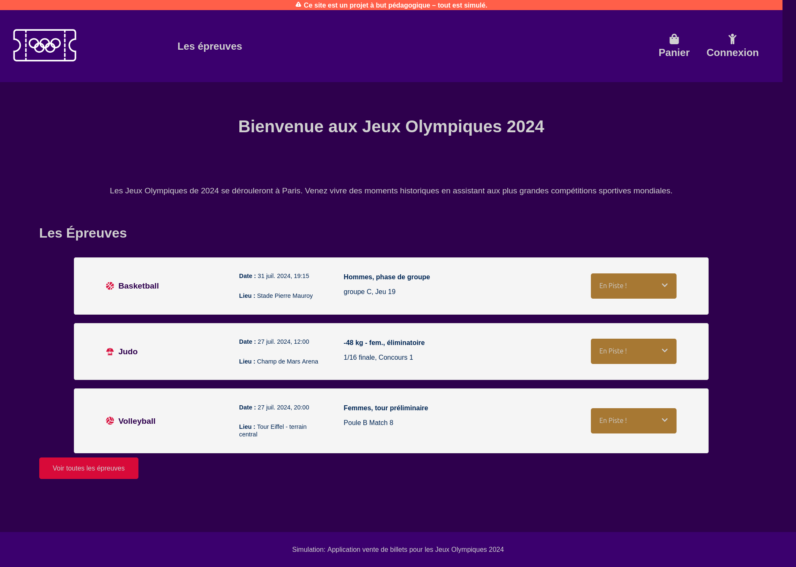
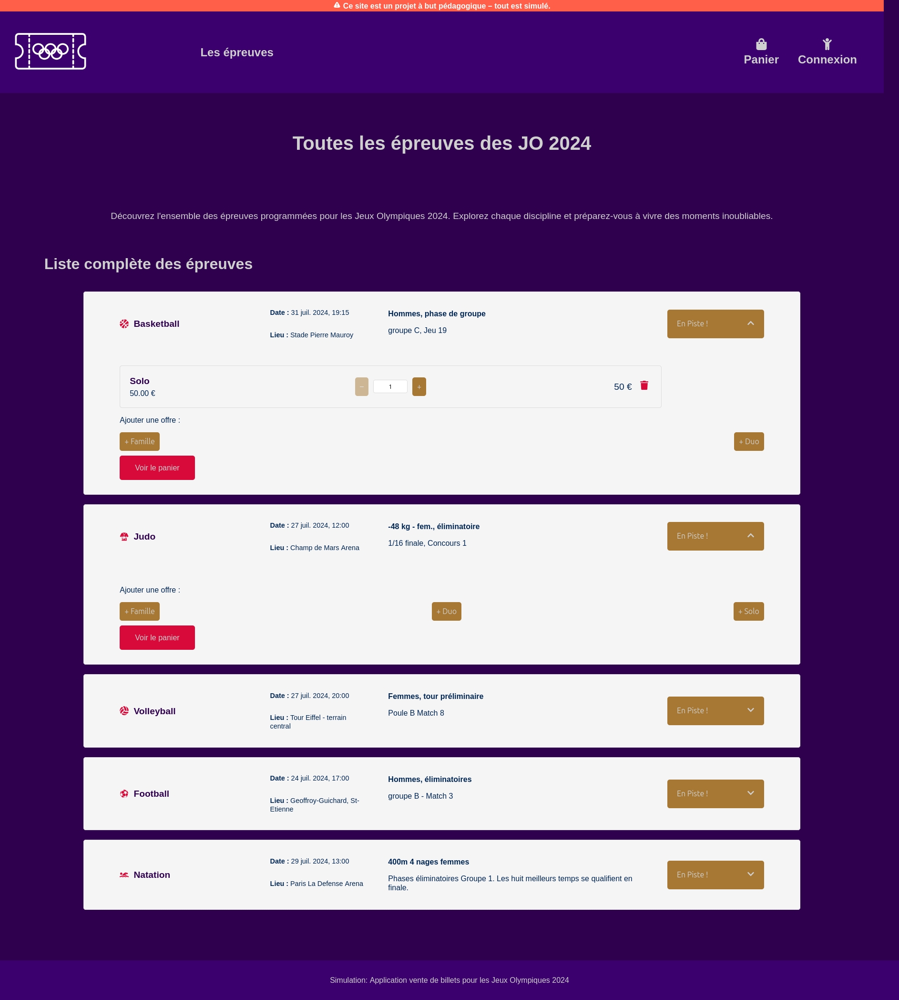
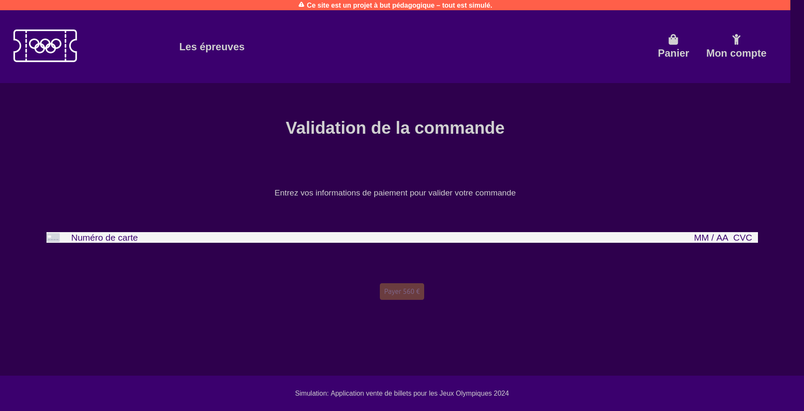
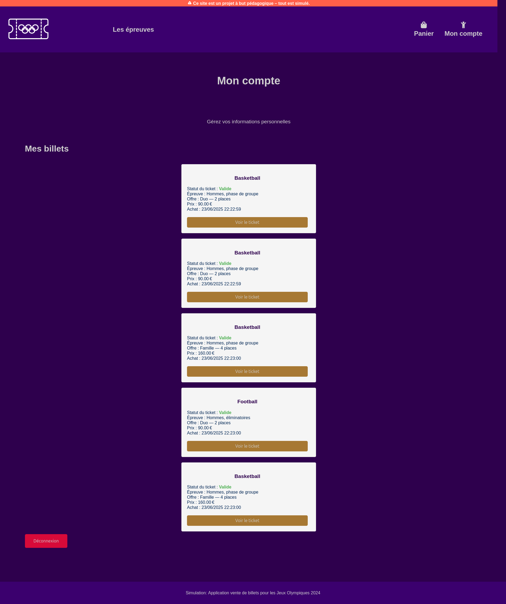
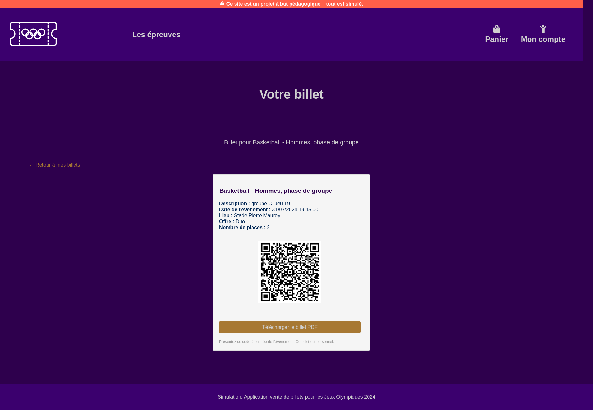
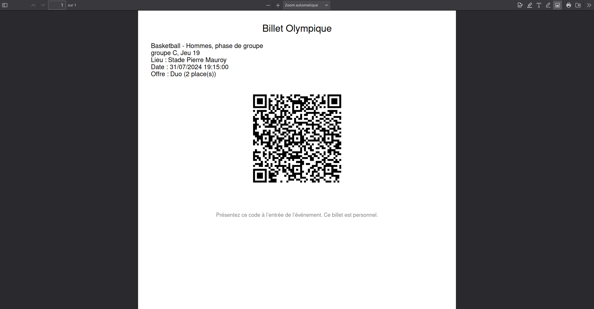

# 🎟️ OG-Tickets – Billetterie en ligne sécurisée (JO Paris 2024)

[](https://github.com/ya-web/og-tickets/actions/workflows/ci.yml)
[](https://github.com/ya-web/og-tickets/actions/workflows/cd.yml)

> **Site officiel :** [https://ogtickets.space](https://ogtickets.space)  
> **Documentation technique complète :** [TECHNICAL_DOC.md](./TECHNICAL_DOC.md)

---

## 🧠 Présentation

**OG-Tickets** est une application web de **billetterie en ligne sécurisée**, inspirée du contexte des JO 2024.  
Développée avec Django REST et React, elle met en œuvre CI/CD, sécurité applicative et infrastructure cloud automatisée.

🧪 _Ce projet est une démonstration technique réalisée dans le cadre d’une formation en conception d’applications Python._

---

## 🧱 Architecture générale

| Composant                    | Hébergement / Technologie                     | CI/CD                                        |
| ---------------------------- | --------------------------------------------- | -------------------------------------------- |
| **Frontend (React)**         | Cloudflare Pages (`og-tickets.pages.dev`)     | Déploiement automatique via Cloudflare Pages |
| **Backend (Django REST)**    | AWS EC2 (Docker + Swarm + Nginx)              | CI/CD via GitHub Actions                     |
| **Base de données**          | PostgreSQL (AWS RDS, accès restreint via SG)  | Automatique (connexion sécurisée depuis EC2) |
| **Proxy / Sécurité / DNS**   | Cloudflare (Workers + WAF + SSL + DNS + HSTS) | Automatique                                  |
| **Nom de domaine principal** | `ogtickets.space`                             | Routage intelligent via Worker               |

> Pour une vue d’ensemble détaillée de l’architecture et du déploiement, consultez la section _Architecture technique_ du [**TECHNICAL_DOC.md**](./TECHNICAL_DOC.md).

---

## ⚙️ Stack technique

| Domaine        | Technologies                                                    |
| -------------- | --------------------------------------------------------------- |
| **Frontend**   | React, SCSS, Cloudflare Pages                                   |
| **Backend**    | Django 5, Django REST Framework, Djoser, Simple JWT, PostgreSQL |
| **DevOps**     | Docker, Swarm, GitHub Actions, Nginx, AWS EC2, Cloudflare       |
| **Sécurité**   | JWT, AES-256-GCM, HMAC-SHA256, CSP, HSTS, HttpOnly Cookies      |
| **Monitoring** | Sentry, Cloudflare Logs, AWS CloudWatch                         |

---

## 🔐 Sécurité applicative

- Authentification JWT (access/refresh)
- Chiffrement AES‑GCM des données sensibles
- QR codes sécurisés (double clé HMAC)
- Activation email obligatoire
- Rôles utilisateurs : `customer`, `admin`, `controller`
- Sécurité HTTP : CSP, HSTS, X‑Frame‑Options
- Supervision : Sentry + logs + alertes CI/CD
- Aucune variable `.env` stockée en clair (backend) – secrets gérés par Docker et GitHub Actions

---

## 🔁 Intégration Continue / Déploiement Continu

### 🧩 Backend – GitHub Actions

- Exécution automatique des **tests unitaires et d’intégration** avec `pytest`
- Build de l’image Docker via `DOCKER_BUILDKIT`
- Injection sécurisée des secrets (`GitHub Secrets` → fichiers `.txt` → `Docker secrets`)
- Déploiement automatisé sur **AWS EC2** via **Docker Swarm**
- Vérification de la santé du service avant validation du déploiement

### 🌐 Frontend – Cloudflare Pages

- Build automatique à chaque push sur `main`
- Variables d’environnement configurées dans Cloudflare :

```bash
REACT_APP_BACKEND_BASE_URL=https://ogtickets.space/
REACT_APP_OFFERS_PATH=api/offers/
REACT_APP_OLYMPIC_EVENTS_PATH=api/olympic_events/
REACT_APP_STRIPE_PUBLIC_KEY=pk_test_XXXXXXXXXXXXXXXXXXXX
```

### 🧱 Déploiement & conteneurisation

L’application **backend** (Django + API REST) est entièrement conteneurisée.  
Le **frontend React** est déployé séparément via **Cloudflare Pages** et ne dispose pas d’image Docker.

#### 🚀 Construction de l’image backend

```bash
DOCKER_BUILDKIT=1 docker build   --build-arg ENV=prod   --build-arg DEBUG=false   --secret id=secret_key,src=secrets/secret_key.txt   -t ogtickets-backend:latest   -f Dockerfile .
```

Les secrets sont stockés temporairement dans `backend/secrets/`, puis supprimés après injection dans les conteneurs.

#### 🧪 Environnement de développement

```bash
POSTGRES_DB=your_db_name POSTGRES_USER=your_user POSTGRES_PASSWORD=your_password docker compose up
```

#### 🌍 Déploiement production

```bash
docker swarm init

docker secret create secret_key secrets/secret_key.txt
docker secret create db_user secrets/db_user.txt
docker secret create db_password secrets/db_password.txt
...

docker stack deploy -c backend/stack.yaml ogtickets-backend-stack

docker service ls
docker service logs ogtickets-backend
```

---

## 🧩 Fonctionnalités principales

- Consultation des épreuves et offres de billets
- Panier persistant (localStorage + DB)
- Espace utilisateur complet (profil, commandes, historique)
- Paiement simulé / transaction sécurisée
- Génération et validation d’e‑tickets par QR code

---

## 🖼️ Aperçus

Les écrans ci-dessous illustrent les principales étapes de parcours utilisateur.

| Écran                                         | Capture                                                          |
| --------------------------------------------- | ---------------------------------------------------------------- |
| 🏠 **Accueil et navigation**                  |       |
| 🎟️ **Ajout d’une offre au panier**            |                 |
| 💳 **Paiement sécurisé (simulation)**         |                                |
| 👤 **Espace utilisateur (profil et billets)** |  |
| 📄 **Visualisation du e-ticket avec QR code** |             |

> 🧪 Exemple de billet exporté en PDF :  
> 

---

## 📈 Évolutions possibles

- Monitoring avancé (CloudWatch, alertes automatisées)
- Mode PWA (billets hors‑ligne)
- RGPD & CGU / Politique de confidentialité
- Caching Redis + montée en charge (ECS / K8s)
- Audit sécurité OWASP ZAP

---

## 👤 Auteur

**Idir Alliche**  
Concepteur & Développeur Full Stack (Projet DevSecOps – Python / Django / React)
Montpellier, France  
[LinkedIn](https://linkedin.com/in/idiralliche) • [GitHub](https://github.com/ya-web)
