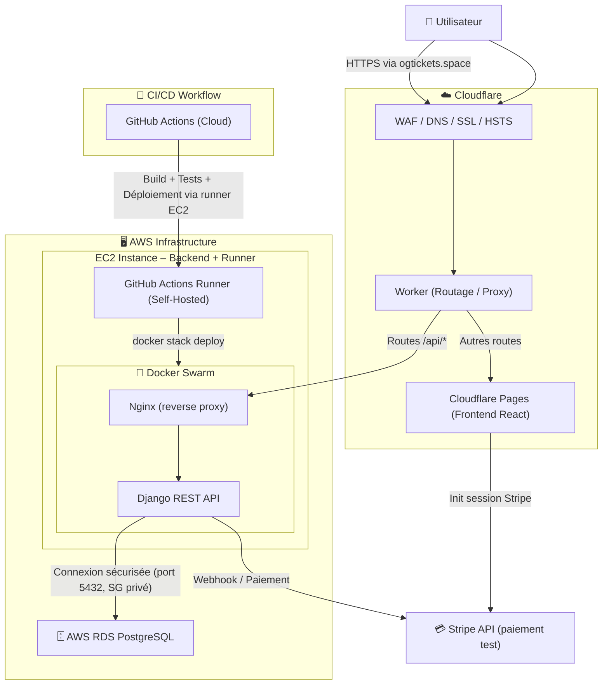
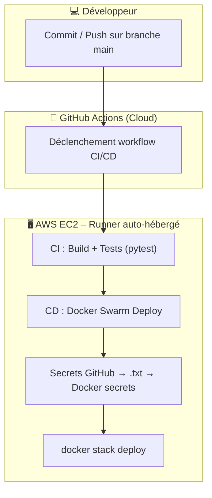

# 🧠 Documentation technique – OG-Tickets

> **Projet :** OG-Tickets – Billetterie en ligne sécurisée  
> **Année :** 2025  
> **Contexte :** Démonstration technique dans le cadre d’une formation Concepteur d’applications Python (projet d’examen)

---

## 📘 Introduction

OG-Tickets est une application web de billetterie en ligne sécurisée, conçue comme démonstration technique d’une architecture **Full Stack DevSecOps**.  
Elle illustre la mise en œuvre complète d’un système moderne basé sur Django REST (backend) et React (frontend), intégrant CI/CD, sécurité applicative et déploiement cloud sur AWS et Cloudflare.

L’objectif principal est de simuler une plateforme de billetterie capable de générer, chiffrer et vérifier des **e-tickets infalsifiables**, tout en assurant performance et sécurité réseau.

---

## ⚙️ 1. Architecture technique

L’infrastructure est organisée autour de plusieurs composants interconnectés et sécurisés :

| Couche                          | Description                                                                 | Hébergement                      |
| ------------------------------- | --------------------------------------------------------------------------- | -------------------------------- |
| **Frontend (React)**            | Interface utilisateur, navigation, panier, paiement, génération de tickets. | Cloudflare Pages                 |
| **Backend (Django + REST API)** | Authentification, logique métier, génération et validation des e-tickets.   | AWS EC2 (Docker + Swarm + Nginx) |
| **Proxy / DNS / Sécurité**      | Routage, HTTPS, WAF, CDN et TLS universel.                                  | Cloudflare (DNS, SSL, Workers)   |
| **Base de données**             | PostgreSQL (instance managée, accès restreint par Security Group).          | AWS RDS                          |
| **CI/CD**                       | Build, test et déploiement automatisé.                                      | GitHub Actions (runner EC2)      |

### 🧭 Diagramme de déploiement



---

## 💻 2. Frontend – React (Cloudflare Pages)

Le frontend, développé avec **React 18**, est déployé automatiquement sur **Cloudflare Pages**.  
Il consomme l’API REST Django pour la gestion des offres, commandes et billets.

### Structure technique

- **Routing :** React Router
- **État :** Hooks + localStorage
- **Style :** SCSS (BEM)
- **Build :** Vite / npm
- **Déploiement :** automatique sur `main` via Cloudflare Pages

### Variables d’environnement

```bash
REACT_APP_BACKEND_BASE_URL=https://ogtickets.space/
REACT_APP_OFFERS_PATH=api/offers/
REACT_APP_OLYMPIC_EVENTS_PATH=api/olympic_events/
REACT_APP_STRIPE_PUBLIC_KEY=pk_test_***************
```

> La couverture de tests front-end (React Testing Library) reste limitée, l’accent ayant été mis sur l’intégration et la sécurité full-stack.

---

## 🔐 3. Gestion des secrets et variables d’environnement

Les variables sensibles ne sont **jamais versionnées**.  
Chaque secret est stocké temporairement dans un fichier texte (`secrets/<nom>.txt`) et injecté via Docker secrets au moment du build.

**Flux des secrets :**

```
GitHub Secrets → Fichiers temporaires (.txt) → Docker Secrets → /run/secrets/
```

**Exemple (GitHub Actions) :**

```bash
echo "${{ secrets.DB_USER }}" > "db_user.txt"
docker secret create db_user secrets/db_user.txt
```

Les fichiers sont supprimés à la fin du job CI/CD.

---

## 🧱 4. Infrastructure Docker & Orchestration

### 🗄️ Base de données – AWS RDS PostgreSQL

- Instance isolée dans le même **VPC** que l’EC2 backend.
- Accès restreint (port 5432) par **Security Group privé**.
- Sauvegardes automatiques et haute disponibilité RDS.

### 🐳 Build & exécution locale

```bash
DOCKER_BUILDKIT=1 docker build   --build-arg ENV=prod   --build-arg DEBUG=false   --secret id=secret_key,src=secrets/secret_key.txt   -t ogtickets-backend:latest   -f Dockerfile .
```

**Développement local :**

```bash
POSTGRES_DB=ogtickets_db POSTGRES_USER=tixidest POSTGRES_PASSWORD=olympics docker compose up
```

### 🚀 Déploiement production

```bash
docker swarm init
docker secret create secret_key secrets/secret_key.txt
docker secret create db_user secrets/db_user.txt
docker stack deploy -c backend/stack.yaml ogtickets-backend-stack
```

> Le reverse proxy **Nginx** gère la terminaison TLS et le routage des requêtes vers les conteneurs backend Django.

---

## 🔁 5. Intégration Continue / Déploiement Continu

### CI (Continuous Integration)

- Vérification du code et du runner Docker.
- Génération des secrets temporaires.
- Build avec `DOCKER_BUILDKIT`.
- Tests automatiques via `pytest`.
- Nettoyage des ressources à la fin du job.

### CD (Continuous Deployment)

- Récupération du code `main`.
- Injection sécurisée des secrets Docker.
- Build et déploiement via `docker stack deploy`.
- Vérification automatique du service actif.

### 🧩 Diagramme CI/CD



---

## ☁️ 6. Routage et Proxy Cloudflare

Le domaine `ogtickets.space` est géré par Cloudflare :

- Routage et proxy via un **Worker**.
- HTTPS universel, cache CDN, WAF, HSTS.
- Sécurité intégrée (DDoS, CSP, CORS).

```js
export default {
  async fetch(request, env, ctx) {
    const url = new URL(request.url);

    if (
      url.pathname.startsWith('/api/') ||
      url.pathname.startsWith('/admin/') ||
      url.pathname.startsWith('/static/admin/') ||
      url.pathname.startsWith('/static/rest_framework/')
    ) {
      url.hostname = 'ogtickets.space';
      return fetch(url.toString(), request);
    }

    url.hostname = 'og-tickets.pages.dev';
    return fetch(url.toString(), request);
  },
};
```

---

## 🧪 7. Tests automatisés

```bash
docker compose --file compose.test.yaml up   --exit-code-from test   --abort-on-container-exit
```

Les tests valident :

- endpoints REST principaux,
- modèles et serializers,
- génération / validation des e-tickets.

> Couverture non exhaustive mais suffisante pour valider la stabilité fonctionnelle.

---

## 💳 8. Intégration Stripe (paiement simulé)

- Clé publique (`REACT_APP_STRIPE_PUBLIC_KEY`) côté frontend.
- Clé privée (`stripe_secret_key.txt`) côté backend via Docker secrets.
- Webhooks simulés pour la génération des e-tickets.

**Reproduction locale :**

```bash
REACT_APP_STRIPE_PUBLIC_KEY=pk_test_...
```

Carte de test : `4242 4242 4242 4242` — `12/34` — `CVC 123`

---

## 📈 9. Monitoring & Sécurité

### Sécurité applicative

- Authentification JWT + double HMAC pour les QR codes.
- CSP, HSTS et cookies HttpOnly.
- HTTPS obligatoire sur toutes les routes.

### Monitoring

- **Sentry** : suivi des erreurs Python / Django.
- **GitHub Security** : audit des dépendances.
- **AWS CloudWatch** : supervision EC2 et logs Docker.

---

## 🧩 10. Pistes d’évolution technique

- Intégration Redis (cache et sessions).
- Passage à Kubernetes / ECS.
- WebSockets pour validation temps réel.
- Couverture de tests étendue (`pytest-cov`).
- Audit OWASP ZAP & durcissement sécurité.

---

_Document technique interne – OG-Tickets (2025)_
